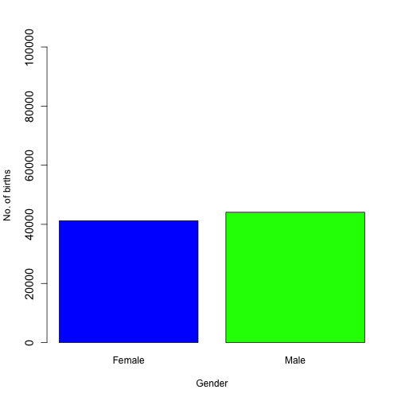

## Hypothesis and Data source

We want to explore the male/female mix of new births in Hong Kong by year, to understand if the ratio changes significantly through the years of 1961 - 2014.

We make use of a public dataset available on the Hong Kong Government Data.One portal, at the following link: https://goo.gl/F9XJtN

--- .class #id 

## Data dimensions


```r
# load data from csv file
births <- read.csv("data/births-by-year.csv")
str(births)
```

```
## 'data.frame':	54 obs. of  4 variables:
##  $ Year         : int  1961 1962 1963 1964 1965 1966 1967 1968 1969 1970 ...
##  $ Birth.rate   : num  35 34 33.5 30.7 28.1 25.3 23.7 21.7 21.3 20 ...
##  $ Male.Births  : int  57361 58161 59064 55388 52029 47489 45668 42608 42480 40734 ...
##  $ Female.Births: int  53523 54342 55486 52237 49081 44343 42547 40077 40002 38398 ...
```

---
## Typical output
This barplot shows results for a single year



